# **Report for the DevOps Assignment – Authored by Mohamed Aziz Mejri CI3**

## Task 1: Prepare the ML Project

I downloaded the ZIP file "`ml-app.zip`" and extracted it , The full path to the extracted folder is `C:\Users\user\Downloads\ml-app\ml-app`

The initial project directory `ml-app` is already equipped with all the essential components: the `src/` folder containing the Python implementation, a `tests/` directory dedicated to validation scripts, the `requirements.txt` file listing all dependencies, and the pre-generated visual outputs such as `confusion_matrix.png` and `feature_importance.png`. This well-structured setup forms the foundation and starting environment for the DevOps assignment.

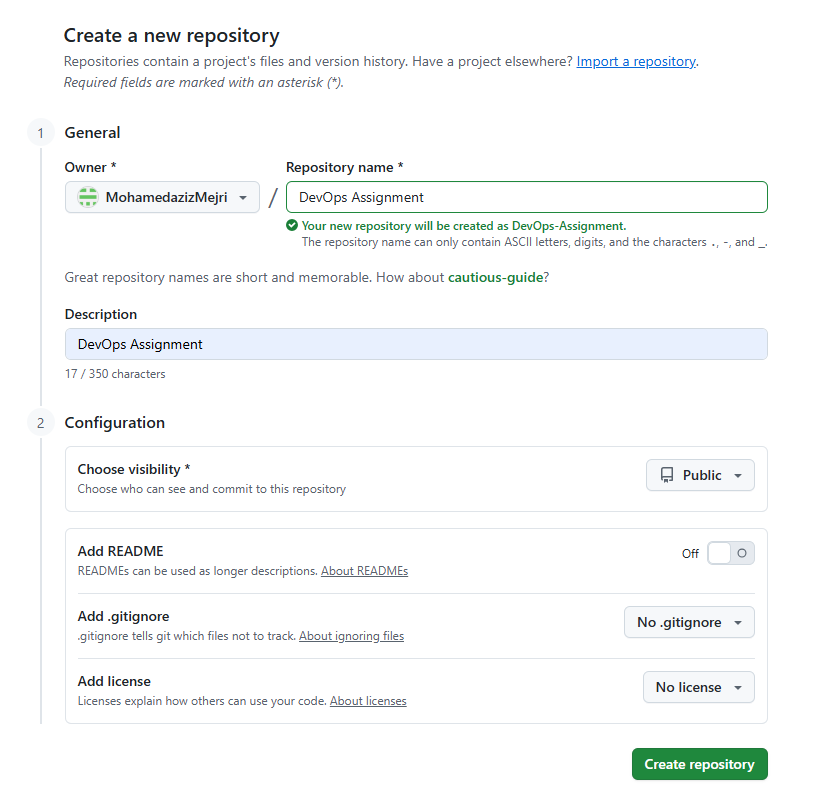

On GitHub, I set up a new remote repository named **DevOpsAssignment** under my personal account. This repository serves as the central location for the project code and acts as the remote origin where all local changes are pushed. It will also be used to execute the GitHub Actions CI workflows throughout the assignment.

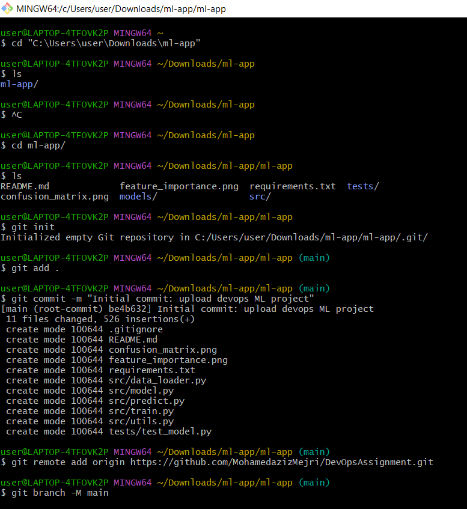

I opened `Git Bash` and navigated to the project directory using `cd "C:\Users\user\Downloads\ml-app\ml-app"` Once inside the **ml-app** folder, I listed the directory contents using `ls` to confirm that all the project files were present.I then initialized a new Git repository with `git init`. After verifying the structure, I staged all files with `git add .` Finally, I created the first commit "git commit -m" with the message **"Initial commit : upload devops ML project"** . This step sets up version control for the project and records the initial state of the application before any further changes are applied.

To connect my local repository with the newly created GitHub repository, I added the remote origin and renamed the primary branch to *main* . After that, I pushed the initial commit using `git push -u origin main`, which uploaded the project to GitHub and established the tracking relationship between the local *main* branch and the remote one.

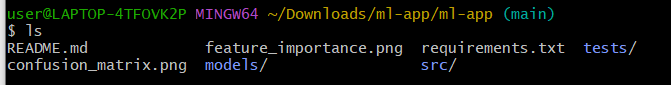

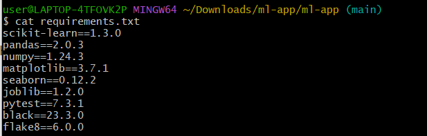

I inspected the repository structure and confirmed that the `requirements.txt` file is present. This ensures that all necessary Python dependencies can be installed properly, which is essential for setting up and running the project without issues.

I used two methods. First, in Git Bash, I listed the contents of the `ml-app` directory using `ls` and verified that the `requirements.txt` file was present. Then I displayed its contents using the `cut` command.

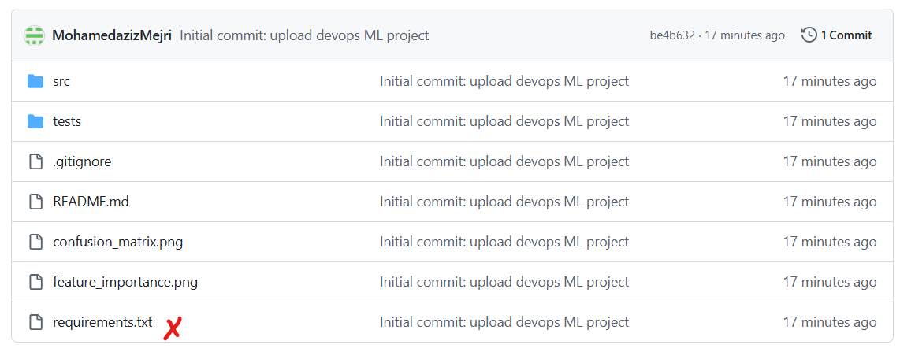

The second method was checking directly on GitHub, where I searched for and verified that the `requirements.txt` file was present.

`The requirements.txt` file listing all Python dependencies for the project, including sc`ikit-learn, pandas, numpy, plotting libraries (matplotlib, seaborn), and development tools like pytest, black, and flake8.` This file is used both locally and in CI to install exactly the same versions of the packages.

## Task 2: Run the app locally

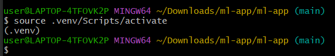

In **Git Bash** , I created a virtual environment for the project by running `python -m venv .venv` 

I then activated it using: `source .venv/Scripts/activate`

Once activated, the terminal prompt displayed `(.venv)`, indicating that the virtual environment is now active. All subsequent Python commands and package installations are executed in this isolated environment, ensuring they do not affect the system Python.

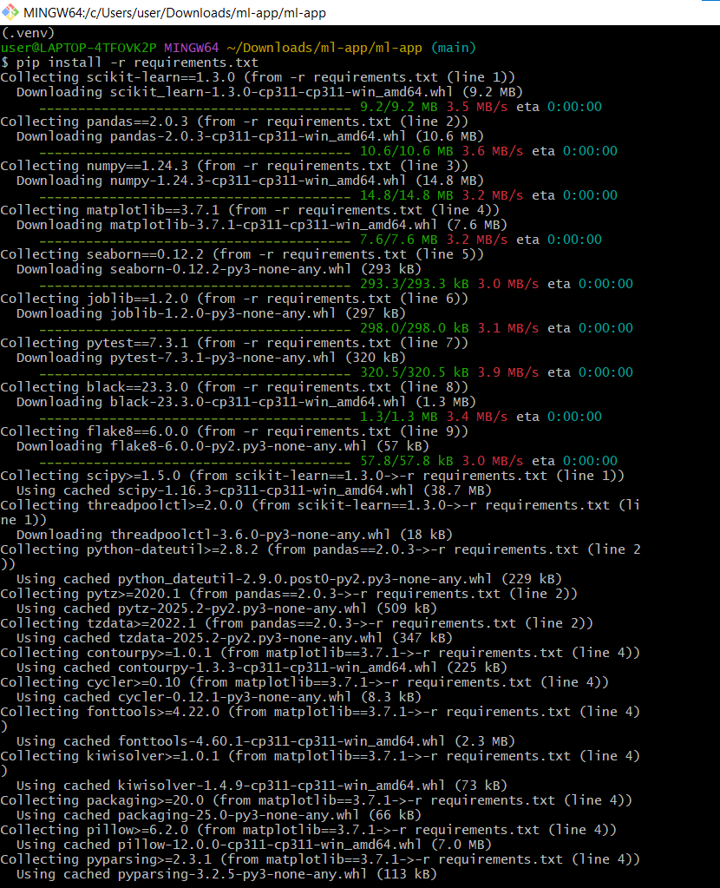

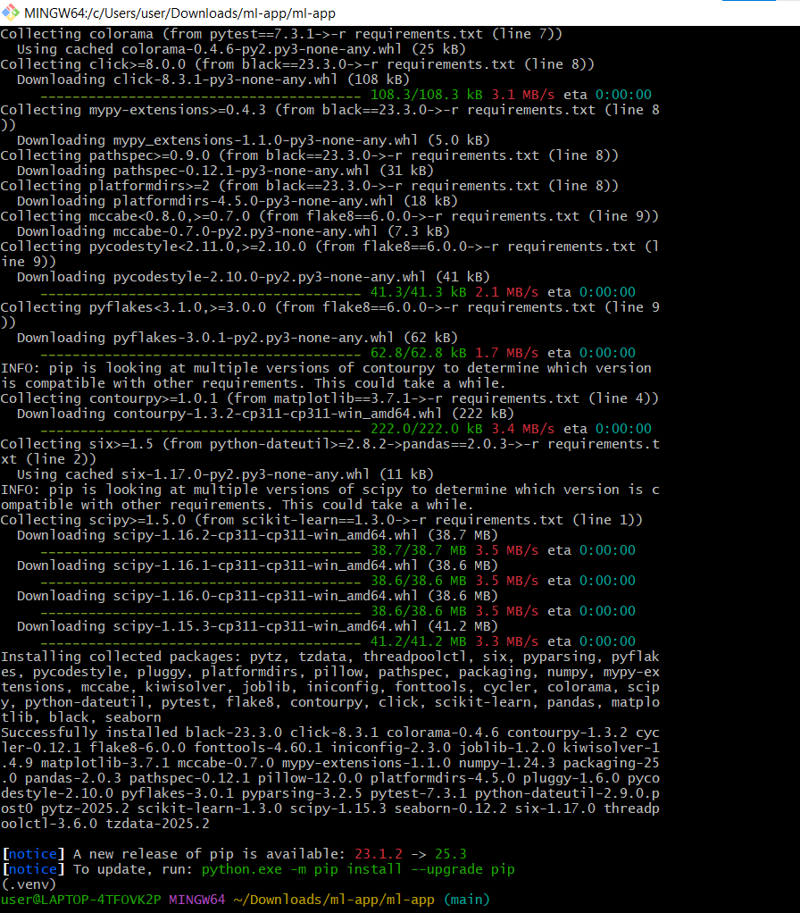

Inside the activated virtual environment, I ran: `pip install -r .\requirements.txt` The terminal displayed `pip` downloading and installing all the necessary packages, including **scikit-learn, pandas, numpy, pytest, flake8** , and others. This step sets up the environment, ensuring that the training scripts, test suites, and development tools can execute properly without dependency issues.

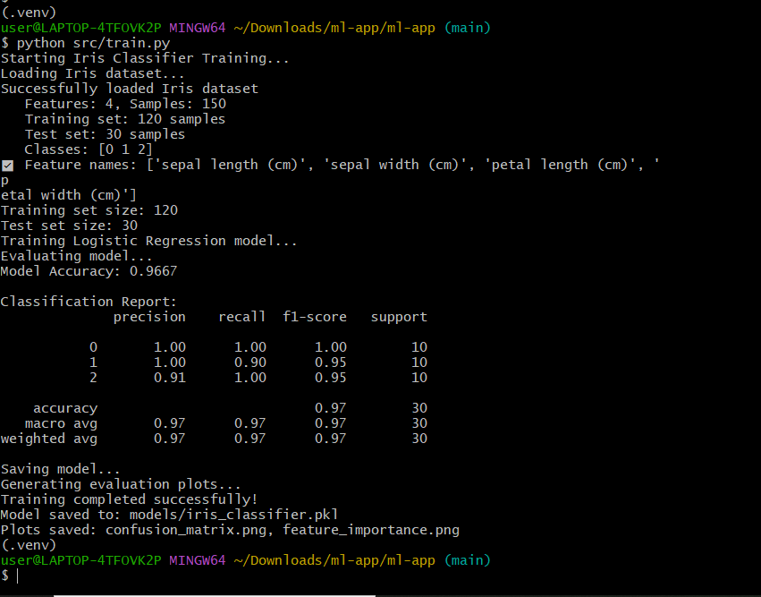

I executed the training script using:`python src\train.py`inside the activated virtual environment. The script performs several tasks: it loads the Iris dataset and displays dataset details such as the number of features, samples, and classes. It then trains the **IrisClassifier** using logistic regression, evaluates its performance on the test set (achieving an accuracy of **0.967** ), and prints the complete classification report. Finally, the script saves the trained model to `models/iris_classifier.pkl` and generates the visualizations `confusion_matrix.png` and `feature_importance.png`.

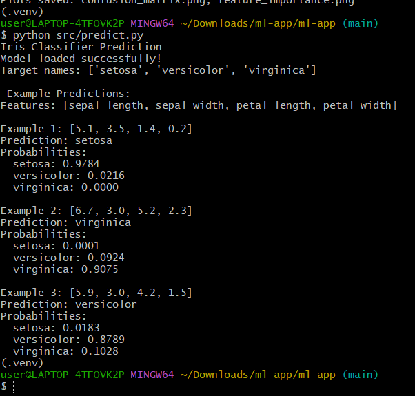

I ran the prediction script using: `python src\predict.py` inside the activated virtual environment. The script loads the previously saved **IrisClassifier** model, retrieves the target class names, and performs three example predictions on predefined Iris feature vectors. For each example, it outputs the predicted class (setosa, virginica, or versicolor) along with the corresponding class probabilities, demonstrating that the model can successfully perform inference on new data.

## Task 3: Write unit tests

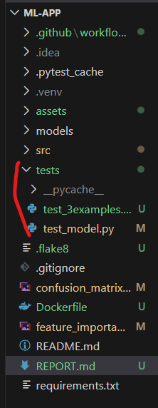

The `test` folder is already created, and inside it there is `test_model` file.

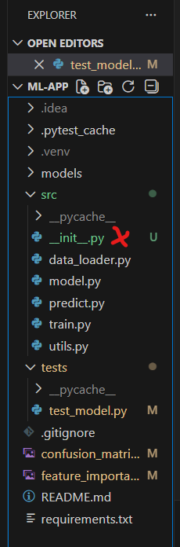

After preparing the project for testing, the structure in **VS Code** shows that the `src` folder now contains an `__init__.py` file, allowing it to function as a proper Python package. The `tests` folder includes the initial `test_model.py` test suite. This organization is necessary so that the test scripts can correctly import modules from `src`.

At first, **pytest** could not detect the modules in the `src` folder, which prevented the tests from running. To fix this, I converted `src` into a proper Python package by adding an `__init__.py` file and made the necessary modifications so that pytest could execute correctly on both the local machine and within the GitHub CI pipeline. It is also essential that test filenames begin with `test_` or end with `_test` to be automatically discovered by pytest.

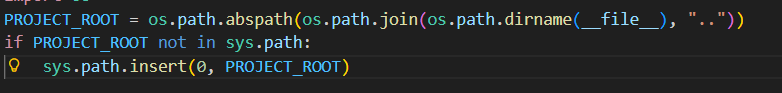

At the beginning of the test file, I calculate `PROJECT_ROOT` using: `os.path.abspath(os.path.join(os.path.dirname(__file__), ".."))` and add it to `sys.path`. This guarantees that the project’s root directory is included in Python’s import path, enabling the test scripts to reliably import `src.data_loader` and `src.model` when running both locally and in the GitHub CI environment.

I tested the `test_model` file by running `pytest test/`, and it worked correctly. This allowed me to verify the core functionality.

When running **pytest** with only the original `tests/test_model.py` file present, the terminal output shows that pytest collected **6 test cases** from `test_model.py`. All tests passed successfully, confirming that the fundamental functionality of `IrisClassifier` and `load_iris_data()` is working correctly.

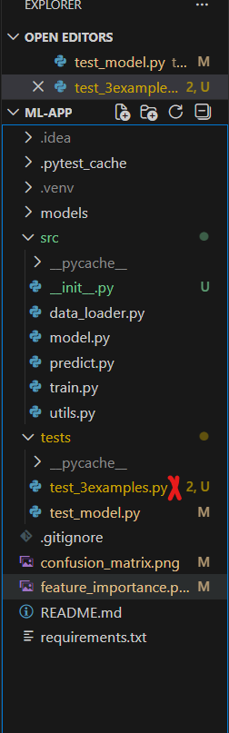

The updated project structure now includes a new test file, `tests/test_3examples.py`, alongside the existing `test_model.py`. This new file contains the additional unit tests "3 meaningful tests (e.g., function outputs, data-format checks, small
model sanity checks)".

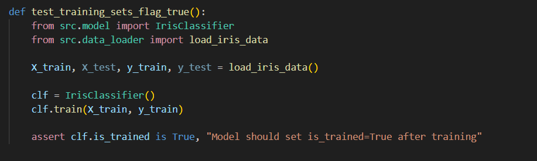

This test checks that the `IrisClassifier` correctly updates its internal state after training. It first loads the Iris dataset using `load_iris_data()`, then creates an instance of `IrisClassifier` and calls its `train()` method with the training features and labels. After training, the test asserts that the classifier’s `is_trained` attribute is set to `True`. If the model fails to update this flag, the assertion triggers an error, ensuring that the classifier properly records when it has been trained.

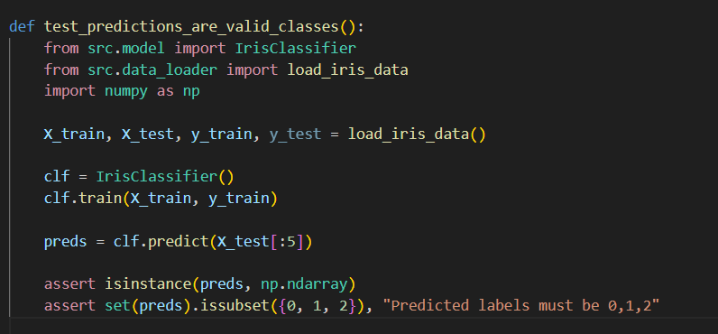

This test verifies that the classifier produces valid class predictions. After loading the Iris dataset and training an `IrisClassifier` on the training split, it uses the model to predict labels for the first five test samples. The test then checks two things: (1) that the predictions come back as a NumPy array, and (2) that every predicted label is one of the allowed Iris class indices—0, 1, or 2. If any prediction falls outside this set, the test fails, ensuring the model outputs only valid class labels.

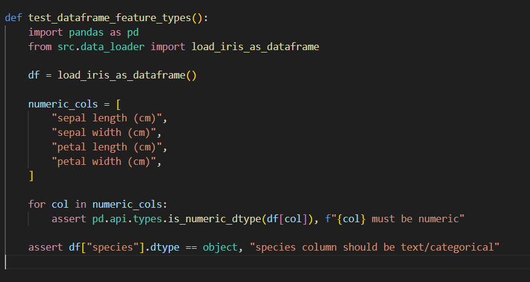

This test ensures that the DataFrame returned by `load_iris_as_dataframe()` has the correct data types for each column. It first defines the four feature columns that should contain numeric values and loops through them, asserting that each one has a numeric dtype. It then checks that the `"species"` column is stored as a text/categorical field (`object` in pandas). If any column has an unexpected type, the test fails, helping guarantee that the data loader produces a properly structured DataFrame for downstream use.

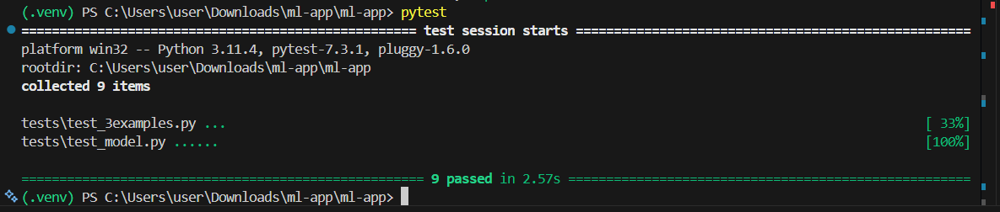

Running **pytest** now detects test cases in both `tests/test_3examples.py` and `tests/test_model.py`, for a total of **9 tests** . All tests pass successfully, confirming that the original tests as well as the additional ones I added are functioning correctly.

## Task 4: Linting & formatting

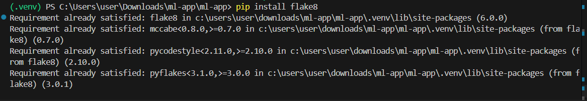

While inside the virtual environment, I installed the linter **flake8** using:`pip install flake8` The terminal output indicated that **flake8** and its dependencies (`mccabe`, `pycodestyle`, `pyflakes`) were already installed in `.venv`. This confirms that the linter is available for running local code checks and ensures consistency with the environment used in the CI workflow.

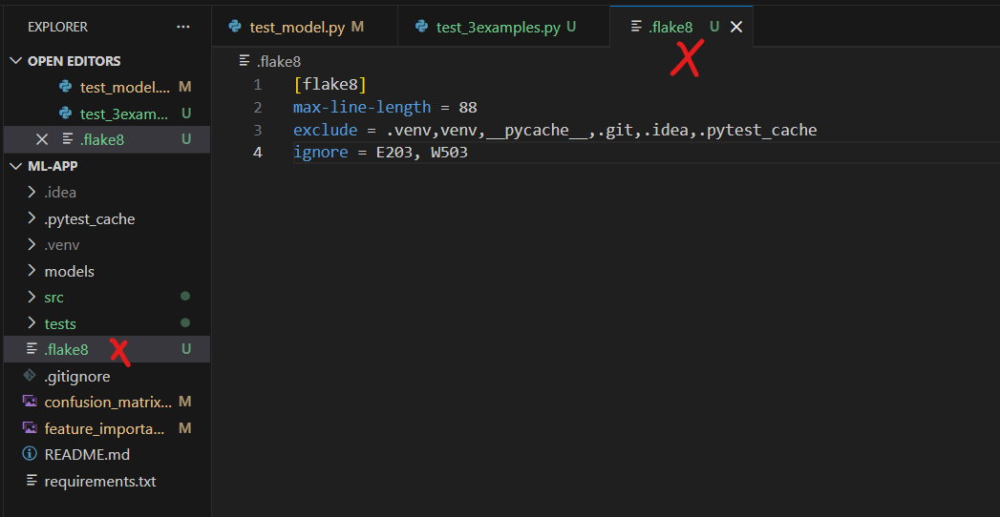

The `.flake8` configuration file is located at the project root. We set `max-line-length = 88` to allow slightly longer lines without triggering errors. The `exclude` option is used to prevent Flake8 from scanning folders that do not contain our source code, such as `.venv`, `__pycache__`, `.git`, `.idea`, and `.pytest_cache`, avoiding unnecessary checks on generated or environment files. Additionally, we disabled the rules **E203** and **W503** . E203 flags spaces in certain slice expressions, and W503 warns when a long expression is split across lines before an operator. Disabling these rules reduces irrelevant warnings and allows Flake8 to focus on meaningful style issues.

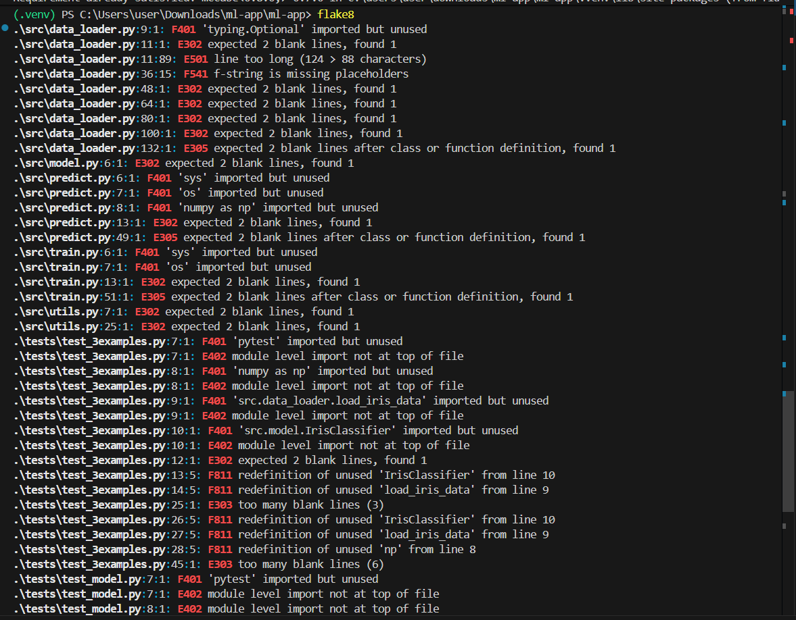

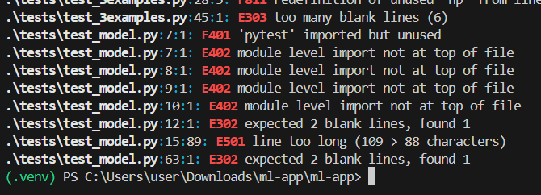

When I first ran **flake8** on the project, the terminal reported several style issues, including missing blank lines, unused imports, lines exceeding 88 characters, and **E402** warnings (“module-level import not at top of file”). I addressed these issues by removing unused imports, adding appropriate blank lines, and shortening long lines. The **E402** warnings were intentionally ignored in cases where I modified `sys.path` before importing modules, as this was necessary for the tests to locate the project packages.

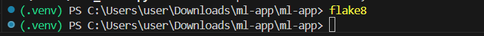

After addressing all reported issues and updating the configuration, I ran **flake8** again. This time, the command produced no output, indicating that there are no remaining linting errors. The codebase now fully complies with the Flake8 style rules defined for the assignment.

## Task 5: GitHub Actions CI workflow

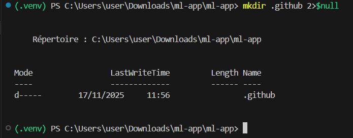

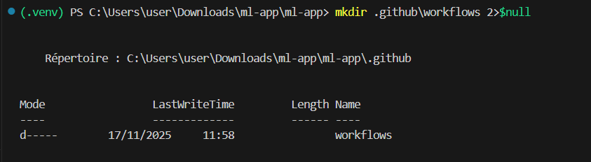

At the project root, I created the `.github` directory along with the `.github/workflows` subdirectory using `mkdir`. These folders are necessary for **GitHub Actions** , as any workflow YAML files placed in `.github/workflows/` are automatically recognized and executed by GitHub whenever commits are pushed or pull requests are opened.

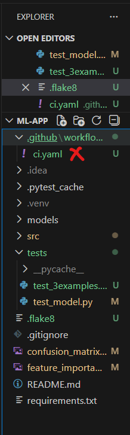

After adding the CI configuration, the project structure now includes the file `.github/workflows/ci.yml` alongside the source code (`src/`), the `tests` folder, the `Dockerfile`, and other configuration files. This YAML file defines the **GitHub Actions pipeline** , which automates running tests, linting, and Docker builds for the assignment.

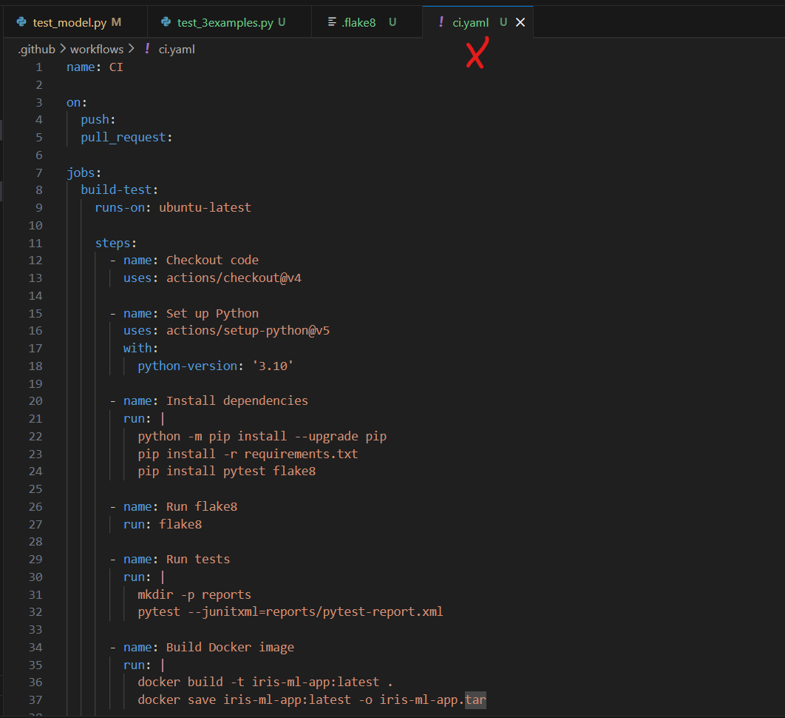

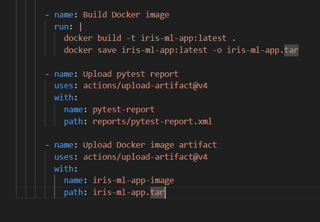

The **ci.yml** GitHub Actions workflow defines the Continuous Integration (CI) pipeline for the project. It runs automatically on every push and pull request. The workflow contains a single job, `build-test`, which executes on an `ubuntu-latest` virtual machine.

The job performs the following steps: it first checks out the project repository, then sets up a Python 3.10 environment. Next, it upgrades `pip`, installs all dependencies from `requirements.txt`, and ensures that `pytest` and `flake8` are available for testing and code style verification. The workflow then runs `flake8` to enforce the coding standards and executes `pytest`, saving the test results in JUnit XML format at `reports/pytest-report.xml`.

After testing, the pipeline builds a Docker image named `iris-ml-app:latest` from the project’s `Dockerfile` and saves it as `iris-ml-app.tar`. Finally, it uploads two artifacts—the pytest report and the Docker image file—so that they can be downloaded and reviewed directly from the GitHub Actions interface.

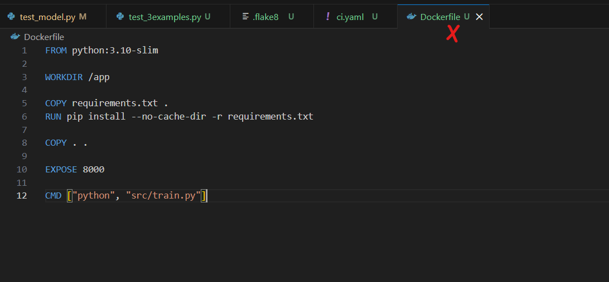

This the final `Dockerfile` used to containerise the Iris ML app

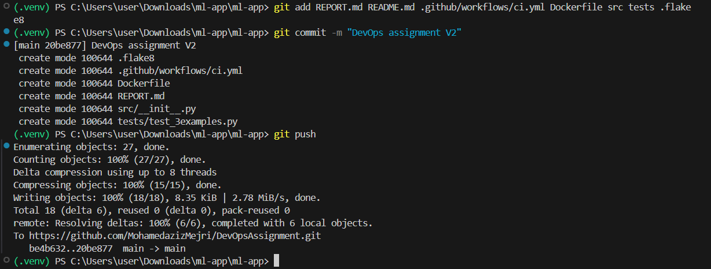

I staged all the relevant project files using:

`git add REPORT.md README.md .github/workflows/ci.yml Dockerfile src tests .flake8`

Then, I created a clear final commit with the message:

`git commit -m "DevOps assignment V2"`

Finally, I pushed the commit to the remote repository `DevOpsAssignment` on GitHub. This action ensures that the CI workflow, Dockerfile, test suite, linter configuration, and the report are all available in the online repository.

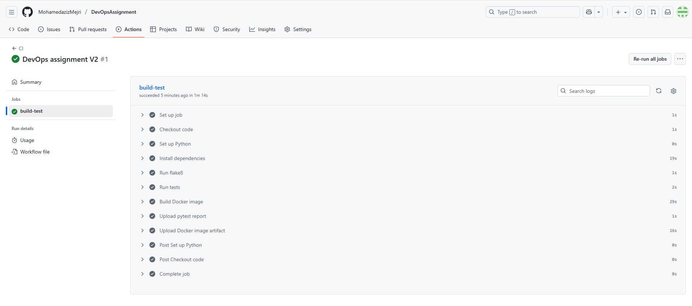

The **GitHub Actions** page shows a successful execution of the CI workflow for the commit **"DevOps assignment: final version (tests, CI, Docker, report)"** . The `build-test` job completed with all steps passing, including repository checkout, Python environment setup, dependency installation, `flake8` linting, `pytest` execution, Docker image build, and artifact uploads. This verifies that the complete CI pipeline is functioning correctly

## Task 6: Containerise the app

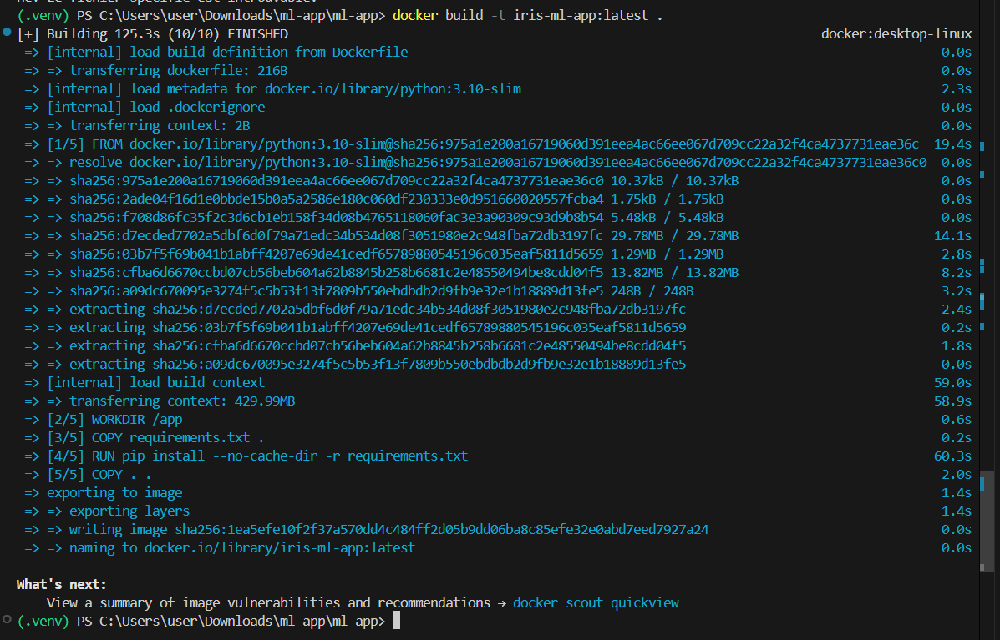

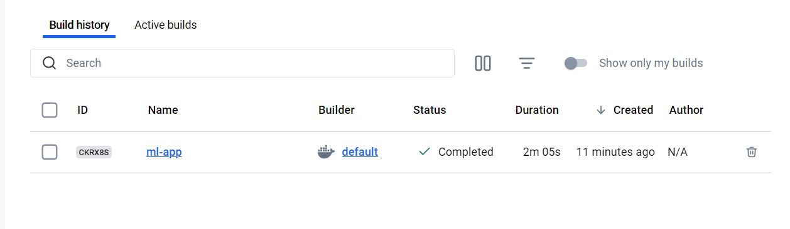

Before building the Docker image, I made sure that **Docker Desktop** was running. In the project root, I then built the Docker image for the Iris ML application using: `docker build -t iris-ml-app:latest .` The terminal output shows Docker pulling the `python:3.10-slim` base image, copying the project files, installing the dependencies from `requirements.txt`, and exporting the layers to create the image tagged `iris-ml-app:latest`. This confirms that the **Dockerfile** builds successfully and produces a working image.

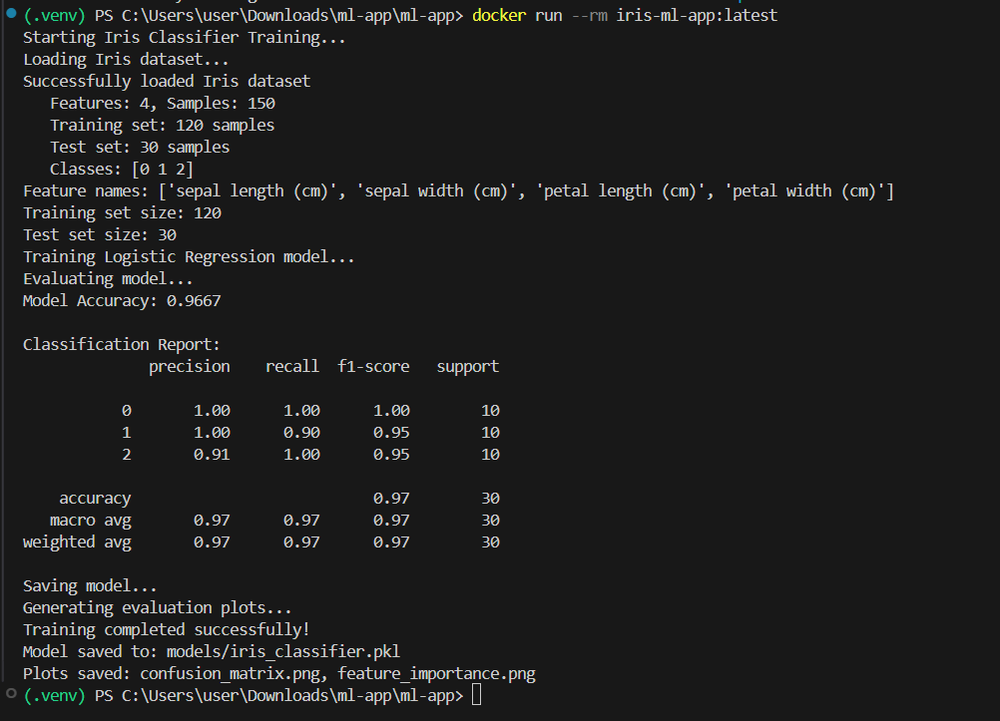

I launched a container from the `iris-ml-app:latest` image using: `docker run --rm iris-ml-app:latest` Inside the container, the `CMD ["python", "src/train.py"]` instruction defined in the Dockerfile executes the training script. The script loads the Iris dataset, displays dataset statistics, trains the logistic regression model, evaluates it (achieving an accuracy of **0.967** ), and saves the trained model along with the evaluation plots. This demonstrates that the containerized application runs correctly and replicates the same training workflow as on the host system.

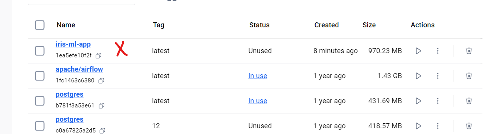

The **Docker Desktop** interface displays the list of local images, including `iris-ml-app:latest` created for this assignment (size: 970.23 MB). Its presence alongside other images such as `ml-app` and `iris-classifier` confirms that the build was successfully stored locally and is available to be run or pushed to a container registry if desired.

<pre class="overflow-visible!" data-start="271" data-end="319">

</pre>

<pre class="overflow-visible!" data-start="290" data-end="338">

</pre>

<pre class="overflow-visible!" data-start="139" data-end="232">

</pre>

<pre class="overflow-visible!" data-start="130" data-end="161">

</pre>

<pre class="overflow-visible!" data-start="141" data-end="186">

</pre>

<pre class="overflow-visible!" data-start="248" data-end="289">

</pre>
